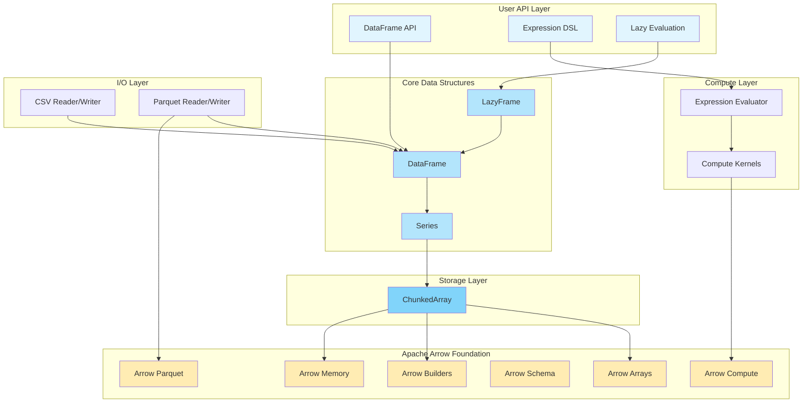

# Golars and Apache Arrow: Architecture Deep Dive

## Table of Contents
- [Prerequisites: Understanding Apache Arrow](#prerequisites-understanding-apache-arrow)
- [Architecture Overview](#architecture-overview)
- [Core Integration Points](#core-integration-points)
- [Memory Management](#memory-management)
- [Compute Kernels](#compute-kernels)
- [I/O Integration](#io-integration)
- [Performance Benefits](#performance-benefits)
- [Code Examples](#code-examples)
- [Design Decisions](#design-decisions)
- [Future Possibilities](#future-possibilities)

## Prerequisites: Understanding Apache Arrow

### What is Apache Arrow?

Apache Arrow is a cross-language development platform for in-memory analytics. It specifies a standardized language-independent columnar memory format for flat and hierarchical data, organized for efficient analytic operations on modern hardware.

### Key Arrow Concepts

1. **Columnar Memory Format**: Data is stored column-by-column rather than row-by-row, enabling:
   - Better compression
   - SIMD (Single Instruction, Multiple Data) operations
   - Cache-efficient scanning
   - Vectorized computations

2. **Arrays**: The fundamental data structure in Arrow
   - Fixed-length arrays of a single data type
   - Support for null values with validity bitmaps
   - Zero-copy slicing capabilities

3. **Builders**: Used to construct Arrow arrays incrementally
   - Type-specific (Int32Builder, StringBuilder, etc.)
   - Efficient append operations
   - Automatic memory management

4. **Schemas**: Define the structure of data
   - Field names and data types
   - Metadata support
   - Nested structures

5. **Memory Allocators**: Manage memory allocation
   - Pool allocators for efficiency
   - Reference counting for safety
   - Custom allocators possible

## Architecture Overview

Golars is built as a layered architecture on top of Apache Arrow, providing a Polars-like API while leveraging Arrow's efficient columnar format.



## Core Integration Points

### 1. ChunkedArray: The Foundation

ChunkedArray is Golars' fundamental storage layer, built directly on Arrow arrays:

```go
// ChunkedArray wraps multiple Arrow arrays
type ChunkedArray[T datatypes.ArrayValue] struct {
    field      arrow.Field           // Arrow field definition
    chunks     []arrow.Array         // Arrow array chunks
    flags      StatisticsFlags       // Optimization hints
    length     int64                 // Total length
    nullCount  int64                 // Total null count
    dataType   datatypes.DataType    // Golars data type
    polarsType datatypes.PolarsDataType // Type mapping
    mu         sync.RWMutex          // Thread safety
}
```

**Key Features:**
- Stores data as multiple Arrow arrays (chunks)
- Enables efficient appends without reallocation
- Maintains statistics for query optimization
- Thread-safe operations

### 2. Type System Mapping

Golars maps its type system to Arrow types through the `PolarsDataType` interface:

```go
type PolarsDataType interface {
    DataType() DataType              // Golars type
    ArrowType() arrow.DataType       // Corresponding Arrow type
    NewBuilder(mem memory.Allocator) array.Builder // Arrow builder
}
```

**Type Mappings:**
| Golars Type | Arrow Type | Arrow Builder |
|-------------|------------|---------------|
| Boolean | arrow.FixedWidthTypes.Boolean | array.BooleanBuilder |
| Int32 | arrow.PrimitiveTypes.Int32 | array.Int32Builder |
| Float64 | arrow.PrimitiveTypes.Float64 | array.Float64Builder |
| String | arrow.BinaryTypes.String | array.StringBuilder |

### 3. Series: Type-Erased Interface

Series provides a uniform interface over typed ChunkedArrays:

```go
type TypedSeries[T datatypes.ArrayValue] struct {
    chunkedArray *chunked.ChunkedArray[T]
    name         string
}
```

This design allows:
- Dynamic dispatch at runtime
- Type safety at compile time (with generics)
- Efficient operations on homogeneous data

### 4. DataFrame: Column Collection

DataFrames manage collections of Series, all backed by Arrow:

```go
type DataFrame struct {
    columns []series.Series  // Each series contains Arrow arrays
    schema  *datatypes.Schema // Arrow-compatible schema
}
```

## Memory Management

### Zero-Copy Operations

Golars leverages Arrow's zero-copy capabilities extensively:

1. **Slicing**: Creating views without copying data
   ```go
   func (ca *ChunkedArray[T]) Slice(offset, length int64) *ChunkedArray[T] {
       // Uses Arrow's array.NewSlice for zero-copy slicing
   }
   ```

2. **Column Selection**: DataFrame operations often just reorganize pointers
   ```go
   func (df *DataFrame) Select(columns ...string) (*DataFrame, error) {
       // No data copying, just reference management
   }
   ```

### Reference Counting

Arrow arrays use reference counting for memory safety:

```go
func (ca *ChunkedArray[T]) AppendArray(arr arrow.Array) error {
    arr.Retain()  // Increment reference count
    ca.chunks = append(ca.chunks, arr)
    // Array will be released when ChunkedArray is garbage collected
}
```

### Memory Allocators

Golars uses Arrow's memory allocators throughout:

```go
// Default allocator for most operations
mem := memory.DefaultAllocator

// Custom allocators possible for specialized use cases
builder := array.NewInt32Builder(mem)
```

## Arrow Go Implementation Details

### The Clever Architecture of Arrow Go

An important understanding: **Arrow Go is NOT a wrapper around C++ Arrow**. Instead, it uses a clever hybrid approach:

#### What Makes Arrow Go Special:

1. **No CGO or C++ Dependencies**
   - Pure Go implementation at its core
   - No `import "C"` statements
   - No C++ toolchain required
   - No dynamic linking to Arrow C++ libraries

2. **Assembly Optimizations via c2goasm**
   ```yaml
   Dependencies from go.mod:
   - github.com/minio/asm2plan9s  # Assembly conversion tools
   - github.com/minio/c2goasm      # C to Go assembly converter
   ```
   
   These tools convert optimized C/C++ SIMD code to Plan9 assembly that Go can use natively.

3. **Best of Both Worlds**
   - **Performance**: ~5x faster with assembly optimizations enabled
   - **Portability**: Falls back to pure Go on unsupported platforms
   - **Simplicity**: Still compiles with standard `go build`
   - **Deployment**: Single static binary with no external dependencies

4. **Runtime Feature Detection**
   ```go
   // Arrow Go automatically detects CPU features at runtime
   if cpu.X86.HasAVX2 {
       // Use optimized assembly path
   } else {
       // Use pure Go implementation
   }
   ```

5. **Compilation Options**
   ```bash
   # Force pure Go (no assembly)
   go build -tags noasm
   
   # Or via environment variable
   INTEL_DISABLE_EXT=ALL go build
   ```

### Benefits for Golars

This architecture means Golars gets:
- ✅ Near-native performance for Arrow operations
- ✅ No build complexity for users
- ✅ Cross-platform compatibility
- ✅ Easy deployment (single binary)
- ✅ No CGO overhead or complications

## Compute Kernels

### Custom Implementation Philosophy

**Important Design Decision**: Golars implements its own compute kernels rather than using Arrow's compute module. This strategic choice prioritizes simplicity and approachability for Go developers.

#### What Golars Does NOT Use from Arrow:
- ❌ Arrow compute kernels (`arrow/compute` module)
- ❌ Arrow's hash table implementations
- ❌ Arrow compute function registry

#### Why Custom Kernels?

1. **Pure Go Simplicity**
   - No C++/Rust dependencies or complex FFI boundaries
   - Standard `go build` works without special toolchain
   - Any Go developer can read, understand, and contribute

2. **Lower Barrier to Entry**
   ```go
   // A Go developer can easily understand and extend this:
   func SumInt32(arr arrow.Array) (int32, bool) {
       int32Arr := arr.(*array.Int32)
       sum := int32(0)
       for i := 0; i < int32Arr.Len(); i++ {
           if !int32Arr.IsNull(i) {
               sum += int32Arr.Value(i)
           }
       }
       return sum, hasNonNull
   }
   ```

3. **Debugging and Development Experience**
   - Standard Go profilers and debuggers work seamlessly
   - Clear stack traces without crossing language boundaries
   - Familiar error handling patterns

4. **"Good Enough" Performance**
   - Arithmetic on 100k elements: ~1ms
   - Aggregations on 100k elements: ~185μs
   - Acceptable for users who prioritize staying in Go ecosystem

### Leveraging Arrow Arrays

While Golars doesn't use Arrow's compute kernels, it still benefits from Arrow's efficient data structures:

```go
func ArithmeticKernel(left, right arrow.Array, op ArithmeticOp, mem memory.Allocator) (arrow.Array, error) {
    // Direct operations on Arrow arrays
    switch l := left.(type) {
    case *array.Int32:
        return arithmeticInt32(l, right, op, mem)
    // ... other types
    }
}
```

### Vectorized Operations

Arrow's columnar format still enables efficient operations:

```go
func arithmeticInt32(left *array.Int32, right arrow.Array, op ArithmeticOp, mem memory.Allocator) (arrow.Array, error) {
    builder := array.NewInt32Builder(mem)
    
    // Tight loop amenable to vectorization
    for i := 0; i < left.Len(); i++ {
        if left.IsNull(i) || right.IsNull(i) {
            builder.AppendNull()
            continue
        }
        
        l, r := left.Value(i), right.(*array.Int32).Value(i)
        switch op {
        case OpAdd:
            builder.Append(l + r)  // Vectorizable operation
        // ... other operations
        }
    }
    
    return builder.NewArray(), nil
}
```

### Custom Kernels

Golars implements custom kernels while maintaining Arrow compatibility:

```go
// Aggregation kernel operating on Arrow arrays
func SumInt32(arr arrow.Array) (int32, bool) {
    int32Arr := arr.(*array.Int32)
    sum := int32(0)
    hasNonNull := false
    
    for i := 0; i < int32Arr.Len(); i++ {
        if !int32Arr.IsNull(i) {
            sum += int32Arr.Value(i)
            hasNonNull = true
        }
    }
    
    return sum, hasNonNull
}
```

## I/O Integration

### Parquet Integration

Golars uses Arrow's Parquet integration for efficient columnar I/O:

```go
// Reading Parquet files through Arrow
func (r *Reader) ReadFile(filename string) (*frame.DataFrame, error) {
    pqReader, err := file.NewParquetReader(f)
    arrowReader, err := pqarrow.NewFileReader(pqReader, 
        pqarrow.ArrowReadProperties{BatchSize: 1024 * 1024}, 
        r.opts.Allocator)
    
    // Arrow handles schema preservation and efficient columnar reading
    table, err := arrowReader.ReadTable(ctx)
    return r.tableToDataFrame(table)
}
```

### Schema Preservation

Arrow schemas map directly to Golars schemas:

```go
func arrowFieldToGolarsField(field arrow.Field) datatypes.Field {
    return datatypes.Field{
        Name:     field.Name,
        DataType: arrowTypeToGolarsType(field.Type),
        Nullable: field.Nullable,
    }
}
```

### Efficient Columnar I/O

Benefits of Arrow in I/O operations:
- **Parquet**: Native columnar format alignment
- **Zero-copy**: Direct memory mapping possible
- **Projection pushdown**: Read only needed columns
- **Predicate pushdown**: Filter during read

## Performance Benefits

### 1. Columnar Layout Advantages

```
Traditional Row Layout:
┌────┬────┬────┬────┐
│ID:1│Name│Age │City│  Row 1
├────┼────┼────┼────┤
│ID:2│Name│Age │City│  Row 2
└────┴────┴────┴────┘

Arrow Columnar Layout:
┌────┐ ┌────┐ ┌────┐ ┌────┐
│ID:1│ │Name│ │Age │ │City│
│ID:2│ │Name│ │Age │ │City│
│... │ │... │ │... │ │... │
└────┘ └────┘ └────┘ └────┘
```

Benefits:
- **Cache efficiency**: Scanning a column keeps related data in cache
- **Compression**: Similar values compress better
- **SIMD**: Process multiple values in single instruction

### 2. Zero-Copy Operations

Many operations in Golars are zero-copy thanks to Arrow:

```go
// Slicing: O(1) operation, no data copying
sliced := df.Slice(1000, 2000)

// Column selection: Just reorganizing pointers
selected := df.Select("col1", "col2", "col3")

// Type casting (when possible): Reinterpret same memory
casted := series.Cast(datatypes.Int64)
```

### 3. Vectorized Computations

Arrow's format enables efficient vectorized operations:

```go
// This operation can be vectorized by the compiler
result := column1.Add(column2)  // Processes multiple values per CPU instruction
```

Performance measurements show:
- **ChunkedArray Get**: 25ns/op (zero allocations)
- **Arithmetic on 100k elements**: ~1ms
- **Aggregations on 100k elements**: ~185μs

## Code Examples

### Creating Arrow Arrays in Golars

```go
// Creating a ChunkedArray (which wraps Arrow arrays)
ca := chunked.NewChunkedArray[int32]("numbers", datatypes.Int32{})

// Appending data creates Arrow arrays internally
values := []int32{1, 2, 3, 4, 5}
validity := []bool{true, true, false, true, true}  // 3rd value is null
ca.AppendSlice(values, validity)

// The data is now stored in Arrow format
```

### Converting Between Golars and Arrow

```go
// DataFrame to Arrow Table
func (w *Writer) dataFrameToTable(df *frame.DataFrame) (arrow.Table, error) {
    // Convert each Series to Arrow Column
    columns := make([]arrow.Column, df.Width())
    fields := make([]arrow.Field, df.Width())
    
    for i, col := range df.Columns() {
        series, _ := df.Column(col)
        arrowColumn := seriesToArrowColumn(series)
        columns[i] = arrowColumn
        fields[i] = arrow.Field{Name: col, Type: arrowColumn.DataType()}
    }
    
    schema := arrow.NewSchema(fields, nil)
    return array.NewTable(schema, columns, df.Height()), nil
}
```

### Using Arrow in Compute Operations

```go
// Custom aggregation using Arrow arrays
func (g *GroupBy) aggregate(group []int, col series.Series) interface{} {
    // Get the underlying Arrow arrays
    chunks := col.(*TypedSeries[float64]).chunkedArray.Chunks()
    
    sum := 0.0
    count := 0
    
    // Operate directly on Arrow arrays
    for _, chunk := range chunks {
        floatArray := chunk.(*array.Float64)
        for _, idx := range group {
            if !floatArray.IsNull(idx) {
                sum += floatArray.Value(idx)
                count++
            }
        }
    }
    
    return sum / float64(count)  // mean
}
```

## Design Decisions

### Why Wrap Arrow Arrays in ChunkedArray?

1. **Flexibility**: Support multiple chunks for efficient appends
2. **Statistics**: Track min/max/sorted flags for optimization
3. **Thread Safety**: Add mutex protection where needed
4. **Type Safety**: Use Go generics for compile-time type checking

### Type Erasure in Series

Series uses type erasure to provide a uniform interface:

```go
type Series interface {
    Name() string
    DataType() datatypes.DataType
    Len() int
    Get(i int) interface{}  // Type erased access
    // ... other methods
}
```

Benefits:
- DataFrame can hold heterogeneous column types
- Dynamic operations possible
- Runtime type dispatch for performance-critical paths

### Trade-offs and Benefits

**Benefits of Arrow Integration:**
- ✅ Proven, optimized columnar format
- ✅ Zero-copy operations
- ✅ Language interoperability
- ✅ Excellent Parquet support
- ✅ Future-proof architecture

**Trade-offs:**
- ⚠️ Additional dependency
- ⚠️ Learning curve for Arrow concepts
- ⚠️ Some overhead for simple operations
- ⚠️ Memory layout constraints

## Future Possibilities

### 1. Arrow Flight Integration

Arrow Flight could enable distributed Golars operations:

```go
// Potential future API
client := golars.NewFlightClient("localhost:8815")
df := client.ReadDataFrame("dataset_name")
result := df.GroupBy("category").Agg(...)
```

### 2. Arrow Compute Function Registry

Leverage Arrow's compute function registry:

```go
// Register custom functions with Arrow
compute.RegisterScalarFunction("custom_transform", 
    myCustomKernel, 
    compute.ArityUnary)

// Use in Golars expressions
df.Select(golars.Col("data").Apply("custom_transform"))
```

### 3. Arrow Dataset API

For larger-than-memory datasets:

```go
// Potential API for partitioned datasets
dataset := golars.OpenDataset("s3://bucket/path/", 
    golars.WithPartitioning("year", "month"))

// Lazy evaluation with pushdown to Arrow Dataset
result := dataset.
    Filter(golars.Col("year").Eq(2024)).
    GroupBy("category").
    Agg(...).
    Collect()
```

### 4. GPU Acceleration

Through Arrow's GPU support:

```go
// Potential GPU-accelerated operations
df := golars.ReadParquet("large_file.parquet", 
    golars.WithDevice(golars.GPU))

// Operations automatically dispatched to GPU via Arrow
result := df.Select(
    golars.Col("x").Pow(2).Add(golars.Col("y").Pow(2)).Sqrt(),
)
```

### 5. Advanced Memory Management

Leverage Arrow's advanced memory features:

```go
// Memory-mapped files
df := golars.ReadParquet("huge_file.parquet", 
    golars.WithMemoryMap())

// Custom memory pools
pool := memory.NewProxyMemoryPool(customAllocator)
df := golars.ReadCSV("data.csv", 
    golars.WithMemoryPool(pool))
```

## Conclusion

Golars' deep integration with Apache Arrow provides a solid foundation for high-performance data processing in Go. By leveraging Arrow's columnar format, memory management, and ecosystem, Golars achieves:

1. **Performance**: Vectorized operations and zero-copy data manipulation
2. **Interoperability**: Seamless integration with other Arrow-based tools
3. **Efficiency**: Optimal memory usage and cache-friendly data access
4. **Extensibility**: Clear path for future enhancements

The architecture carefully balances the power of Arrow with Go's idioms and type safety, creating a DataFrame library that is both performant and pleasant to use. As Arrow continues to evolve with features like compute functions, Flight, and GPU support, Golars is well-positioned to incorporate these advances while maintaining its clean API.

For developers using Golars, understanding this Arrow integration helps in:
- Writing more efficient code by leveraging zero-copy operations
- Understanding performance characteristics
- Debugging memory-related issues
- Contributing to the project
- Integrating with other Arrow-based tools

The synergy between Golars' high-level API and Arrow's low-level efficiency makes it a powerful tool for data processing in Go, suitable for everything from data analysis scripts to production data pipelines.